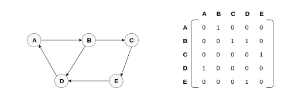
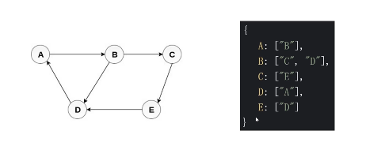
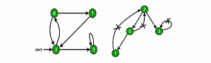

# 图

-   图是网络结构的抽象模型，是一组由边连接的节点
-   图可以表示任何二元关系，比如道路，航班

在 JS 中，没有图数据结构，使用 Object 和 Array 构建图
图的表示法： 邻接矩阵，邻接表，关联矩阵 ...

## 图的表示法： 邻接矩阵



## 图的表示法： 邻接表



### 图的常用操作

-   深度优先遍历
-   广度优先遍历

## 图的深度优先遍历和广度优先遍历

### 什么是深度/广度优先遍历？

-   深度优先遍历： 尽可能深的搜索图的分支
-   广度优先遍历： 先访问离根节点最近的节点

### 深度优先遍历口诀

-   访问根节点
-   对根节点的`没有访问过的相邻节点`挨个进行深度优先遍历



```js
// graph.js
const graph = {
    0: [1, 2],
    1: [2],
    2: [0, 3],
    3: [3],
};

module.exports = graph;

// dfs.js
const graph = require('./graph');

const visted = new Set(); // 记录访问过的节点
const dfs = function(n) {
    console.log(n);

    // 访问没有访问过的节点
    visted.add(n);
    graph[n].forEach(c => {
        if (!visted.has(c)) {
            dfs(c);
        }
    });
};

dfs(2); // 2-0-1-3
```
