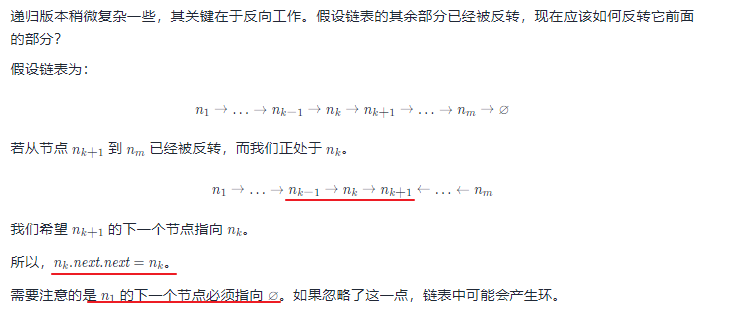
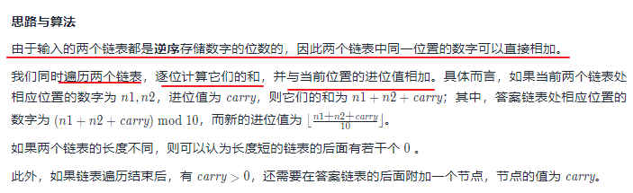
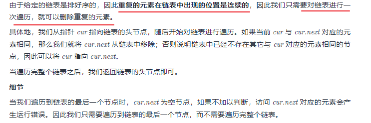

# 链表-linkedList

**链表是什么？**

-   多个元素组成的列表
-   元素存储不连续，使用 next 指针连在一起
    

**数组和链表大的区别**

数组：增删非首尾元素时往往需要移动元素。

链表：增删非首尾元素，不需要移动元素，只需要更改 next 的指针

#### [237. 删除链表中的节点](https://leetcode-cn.com/problems/delete-node-in-a-linked-list/)

-   如何删除指定的链表节点

#### [206. 反转链表](https://leetcode-cn.com/problems/reverse-linked-list/)

-   反转链表： 双指针 or 递归

双指针： 快慢指针遍历链表， 两两反转

```js
var reverseList = function(head) {
    // 定义双指针 point1 比 point 2 快一步
   let point1 = head
   let point2 = null

   while(point1) {
       const temp = point1.next
       point1.next = point2
       point2 = point1
       point1 = temp
   }

   return point2
};
```

**复杂度分析**

- 时间复杂度：O(n)，其中 n 是链表的长度。需要遍历链表一次。
- 空间复杂度：O(1)。

递归:



```js
var reverseList = function(head) {
    if (head == null || head.next == null) {
        return head;
    }
    const newHead = reverseList(head.next);
    head.next.next = head;
    head.next = null;
    return newHead;
};

```

复杂度分析

时间复杂度：O(n)，其中 n 是链表的长度。需要对链表的每个节点进行反转操作。

空间复杂度：O(n)，其中 n 是链表的长度。空间复杂度主要取决于递归调用的栈空间，最多为 n层。

#### [2. 两数相加](https://leetcode-cn.com/problems/add-two-numbers/)

- 遍历链表 加法模拟 注意边界条件

  
  
  ```js
  var addTwoNumbers = function(l1, l2) {
      let l3 = new ListNode(0);
      let p1 = l1;
      let p2 = l2;
      let p3 = l3;
      let carry = 0; // 十位
      while(p1 || p2) {
          const v1 = p1 ? p1.val : 0;
          const v2 = p2 ? p2.val : 0;
          const sum = v1 + v2 + carry; // 对应位置两数之和加进位
          carry = Math.floor(sum / 10); // 进位/十位
          p3.next = new ListNode( sum % 10); // 个位
          // 链表next
          if(p1) p1 = p1.next;
          if(p2) p2 = p2.next;
          p3 = p3.next;
      }
      // 最后判断 carry 是否存在
      if(carry) {
          p3.next = new ListNode(carry)
      }
      return l3.next;
  };
  ```

#### [83. 删除排序链表中的重复元素](https://leetcode-cn.com/problems/remove-duplicates-from-sorted-list/)

- 遍历链表 删除重复的节点

  ```js
  var deleteDuplicates = function(head) {
      // 如果 链表不存在直接返回
      if (!head) {
          return head;
      }
  	// 单指针遍历链表
      // 如果当前值和下一个节点值相等，则直接cur.next = cur.next.next
      // 否： cur = cur.next
      let cur = head;
      while (cur.next) {
          if (cur.val === cur.next.val) {
              cur.next = cur.next.next;
          } else {
              cur = cur.next;
          }
      }
      return head;
  };
  ```

  

#### 主要操作： 如何遍历链表和删除链表的节点

遍历： 单指针遍历，双指针遍历
节点删除： 重复节点删除，指定节点删除，倒数节点删除




**技术要点：**

链表里的元素存储不是连续的，之间通过 next 连接

JavaScript 中没有链表，但是可以用 Object 模拟链表

链表常用操作：修改 next、遍历链表。

**前端知识点：**

JS 中的原型链也是一个链表

使用链表指针获取 JSON 的节点值
