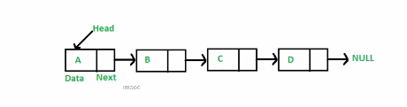

# 链表

**链表是什么？**

-   多个元素组成的列表
-   元素存储不连续，使用 next 指针连在一起
    

**数组和链表大的区别**

数组：增删非首尾元素时往往需要移动元素。

链表：增删非首尾元素，不需要移动元素，只需要更改 next 的指针

#### [237. 删除链表中的节点](https://leetcode-cn.com/problems/delete-node-in-a-linked-list/)

-   如何删除指定的链表节点

#### [206. 反转链表](https://leetcode-cn.com/problems/reverse-linked-list/)

-   反转链表： 双指针 or 递归

#### [2. 两数相加](https://leetcode-cn.com/problems/add-two-numbers/)

-   遍历链表 加法模拟 注意边界条件

#### [83. 删除排序链表中的重复元素](https://leetcode-cn.com/problems/remove-duplicates-from-sorted-list/)

-   遍历链表 删除重复的节点

#### 主要操作： 如何遍历链表和删除链表的节点

遍历： 单指针遍历，双指针遍历
节点删除： 重复节点删除，指定节点删除，倒数节点删除

**技术要点：**

链表里的元素存储不是连续的，之间通过 next 连接

JavaScript 中没有链表，但是可以用 Object 模拟链表

链表常用操作：修改 next、遍历链表。

**前端知识点：**

JS 中的原型链也是一个链表

使用链表指针获取 JSON 的节点值
