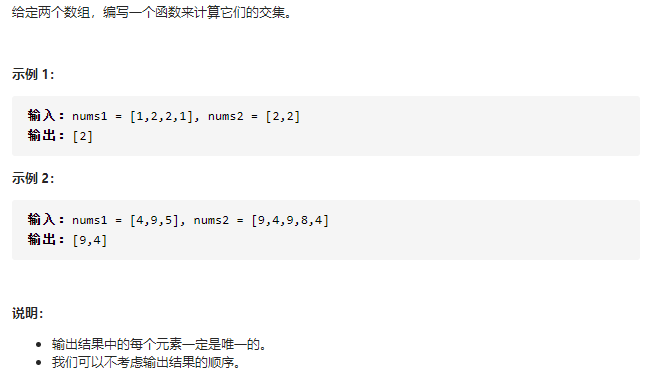

# 集合-Set

**集合是什么？**

-   一种`无序且唯一`的数据结构
-   ES6 中有集合，名为 Set
-   集合常用操作： 去重、判断某元素是否在集合中，求交集...

```js
// 去重
const arr = [1, 1, 2, 2];

const arr1 = [...new Set(arr)];

// 判断元素是否在集合中
const set = new Set(arr);

const has = set.has(2);

// 求交集
const set2 = new Set([2, 3]);

const set3 = new Set([...set].filter(item => set2.has(item)));
```

#### Leetcode 算法题

#### [349. 两个数组的交集](https://leetcode-cn.com/problems/intersection-of-two-arrays/)



**解题思路：**

-   求交集且唯一

**解题步骤**

-   用集合对 nums1 去重
-   遍历 nums1,筛选 nums2 也包含的值

```js
/**
 * @param {number[]} nums1
 * @param {number[]} nums2
 * @return {number[]}
 */
var intersection = function(nums1, nums2) {
    return [...new Set(nums1)].filter(n => new Set(nums2).has(n));
};

// 优化，利用Array.prototype.includes()
var intersection = function(nums1, nums2) {
    return [...new Set(nums1)].filter(n => nums2.includes(n));
};
```

时间复杂度： O（m \* n）

空间复杂度： O（m）

#### ES6 中 Set

```js
// 前端与集合： 使用 ES6 的 Set

// Set 操作：

// 使用Set 对象 ：new、add、delete、has、size

// 迭代Set：多种迭代方法、Set 与Array 互转、 求交集/差集

let mySet = new Set();

// 添加元素 add
mySet.add(1); // 字符串
mySet.add(5);
mySet.add('some text'); // 字符串

let o = { a: 1, b: 2 };
mySet.add(o); // 对象
mySet.add({ a: 1, b: 2 });

// 查找 has
let result = mySet.has(o);

// 删除元素
mySet.delete(5);

// 迭代
// 1. for ... of ... mySet
for (let item of mySet) {
    console.log(item);
}
// 2. mySet.keys()
for (let item of mySet.keys()) console.log(item);

// 3. mySet.values()
for (let item of mySet.values()) console.log(item);

// 4. mySey.entries()
for (let [key, value] of mySet.entries()) console.log(key, value);

// set 和 arry 互转

// 1. set => array

const myArry = [...mySet];

const myArry1 = Array.from(mySet);

// 2. array => set

const mySet2 = new Set([1, 2, 3]);

// 求交集

const intersection = new Set([...mySet].filter(i => mySet2.has(i)));

// 求差集
const difference = new Set([...myset].filter(i => !mySet2.has(i)));
```
