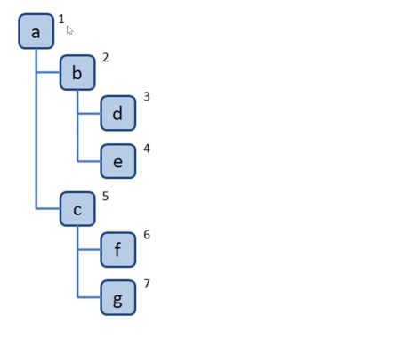
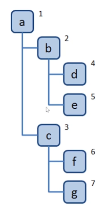
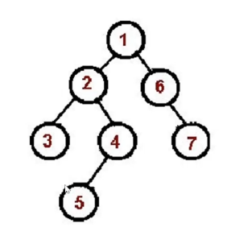
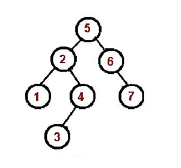
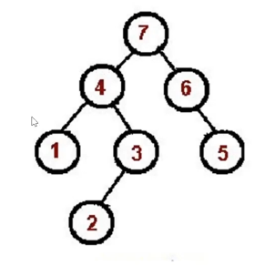

# 树 - tree

### 树是什么？

一种`分层`数据的抽象模型

前端工作常见的树包括： DOM 树， 级联选择器，树形控件

在 JS 中没有树， 使用 Object 和 Array 构建树

树的常用操作： 深度/广度优先遍历、先中后序遍历

## 深度/广度优先遍历？

### 深度优先遍历- Depth-First-Search

尽可能深的搜索树的分支


算法口诀：

-   访问根节点
-   对根节点的 children 挨个进行深度优先遍历

```js
const dfs = root => {
    console.log(root.val);
    root.children.forEach(child => {
        dfs(child);
    });
};
```

## 广度优先遍历 - Breadth-First-Search

先访问离根节点最近的节点


广度优先遍历口诀：

-   新建一个队列，把根节点入队
-   把对头出队访问
-   把队头的 children 挨个入队
-   重复第二三步直到队列为空

```js
const bfs = root => {
    const queue = [root];

    while (queue.length > 0) {
        const head = queue.shift();
        console.log(head.val);
        head.children.forEach(children => {
            queue.push(children);
        });
    }
};
```

## 二叉树

**二叉树是什么？**

-   树种每个节点最多只能有两个子节点
-   在 JS 中通常用 Object 来模拟二叉树

```js
const binaryTree = {
    val: 1,
    left: {
        val: 2,
        left: null,
        right: null,
    },
    right: {
        val: 3,
        left: null,
        right: null,
    },
};
```

### 先序遍历算法口诀

-   访问根节点
-   对根节点的左子树进行先序遍历
-   对根节点的右子树进行先序遍历



```js
const preorder = root => {
    if (!root) {
        return;
    }
    console.log(root.val);
    preorder(root.left);
    preorder(root.right);
};

// 非递归版： 调用堆栈

const preorder = root => {
    if (!root) {
        return;
    }
    const stack = [root];
    const top = stack.pop();
    while (stack.length) {
        console.log(top.val);
        if (top.right) stack.push(top.right);
        if (top.left) stack.push(top.left);
    }
};
```

### 中序遍历算法口诀

-   对根节点的左子树进行中序遍历
-   访问根节点
-   对根节点的右子树进行中序遍历
    

```js
const inorder = root => {
    if (!root) {
        return;
    }
    inorder(root.left);
    console.log(root.val);
    inorder(root.right);
};

/**
 * 迭代版本
 * 1. 遍历 树 拿到 所有的左节点： 利用指针
 * 2. 获取栈顶的节点，将 节点的值推入 res 中， 将指针指向 节点的右子树
 * 3. 倒数第一个节点，倒数第二个节点，依次将 stack内的节点弹出
 */

const inorder = root => {
    if (!root) {
        return;
    }
    const res = [];
    const stack = [];
    let p = root; // 指针
    while (stack.length || p) {
        while (p) {
            stack.push(p);
            p = p.left;
        }
        const n = stack.pop(); // 栈顶 左节点弹出
        console.log(n.val);
        p = n.right;
    }
};

// 时间复杂度： 遍历了整个树 ，O(n)
// 空间复杂度： 利用数组进行存储 O(n)
```

### 后序遍历算法口诀

-   对根节点的左子树进行后序遍历
-   对根节点的右子树进行后序遍历
-   访问根节点



```js
const postorder = root => {
    if (!root) {
        return;
    }
    postorder(root.left);
    postorder(root.right);
    console.log(root.val);
};

// 非递归版 利用栈后进先出特性 两个栈
const postorder = root => {
    if (!root) {
        return;
    }
    const outputStack = [];
    const stack = [root];
    while (stack.length) {
        const n = stack.pop();
        outputStack.push(n);
        if (n.left) stack.push(n.left);
        if (n.right) stack.push(n.right);
    }
    // 倒序输出 left -right -root
    while (outputStack.length) {
        const n = outputStack.pop();
        console.log(n.val);
    }
};
```

## LeetCode 算法题

#### [144. 二叉树的前序遍历](https://leetcode-cn.com/problems/binary-tree-preorder-traversal/)（easy）

#### [94. 二叉树的中序遍历](https://leetcode-cn.com/problems/binary-tree-inorder-traversal/) (easy)

#### [145. 二叉树的后序遍历](https://leetcode-cn.com/problems/binary-tree-postorder-traversal/) (easy)

```js
// 迭代版本的关键性代码
// 前序遍历
while (stack.length || point) {
    while (point) {
        res.push(point.val);
        stack.push(point);
        point = point.left;
    }
    const node = stack.pop();
    point = node.right;
}
return res;

// 中序遍历
while (stack.length || point) {
    while (point) {
        stack(point);
        point = point.left;
    }
    const node = stack.pop();
    res.push(node.val);
    point = node.right;
}
return res;

// 后序遍历
while (stack.length || point) {
    while (point) {
        res.push(point.val);
        stack(point);
        point = point.right;
    }
    const node = stack.pop();
    point = node.left;
}
return res.reverse();
```

前中后三种关键代码五行左右，深度遍历，利用栈的特性：先进后出， 模拟递归堆栈的过程

[LeetCode 104 二叉树的最大深度](https://leetcode-cn.com/problems/maximum-depth-of-binary-tree/)

解题思路

-   求最大深度，考虑使用深度优先遍历
-   在深度优先遍历过程中，记录每个节点所在的层级，找出最大的层级即可

解题步骤

1. 新建一个变量，记录最大深度。
2. 深度优先遍历整棵树，并记录每个节点的层级，同时不断刷新最大深度这个变量。
3. 遍历结束返回最大深度这个变量。

```js
/**
 * @param {TreeNode} root
 * @return {number}
 */
var maxDepth = function(root) {
    let res = 0;
    const dfs = (n, level) => {
        if (!n) {
            return;
        }
        console.log(n.val, level);
        if (!n.left && !n.right) {
            //  逻辑优化： 叶子节点执行 res刷新的逻辑
            res = Math.max(res, level);
        }
        dfs(n.left, level + 1);
        dfs(n.right, level + 1);
    };
    dfs(root, 1);
    return res;
};
```

[LeetCode 111 二叉树的最小深度](https://leetcode-cn.com/problems/minimum-depth-of-binary-tree/)

解题思路

-   求最小深度，考虑使用广度优先遍历
-   在广度优先遍历过程中，遇到叶子节点，停止遍历，返回节点层级

解题步骤

1. 广度优先遍历整棵树，并记录每个节点的层级
2. 遇到叶子节点，返回节点层级，停止遍历

```js
/**
 * @param {TreeNode} root
 * @return {number}
 */
var minDepth = function(root) {
    if (!root) {
        return 0;
    }
    const queue = [[root, 1]];
    while (queue.length) {
        const [node, length] = queue.shift();
        if (!node.left && !node.right) {
            // 遇到叶子节点返回长度
            return length;
        }
        if (node.left) queue.push([node.left, length + 1]);
        if (node.right) queue.push([n.right, length + 1]);
    }
};
```

[LeetCode 102 二叉树的层序遍历](https://leetcode-cn.com/problems/binary-tree-level-order-traversal/)

解题思路：

-   层序遍历顺序就是广度优先遍历
-   不过在遍历的时候需要记录当前节点所处的层级，方便将其添加到不同的数值中。

解题步骤

1. 广度优先遍历二叉树
2. 遍历过程中，记录每个节点的层级，并将其添加到不同的数组中

```JS
// 第一步： 写广度优先遍历二叉树
/**
 * @param {TreeNode} root
 * @return {number[][]}
 */
var levelOrder = function(root) {
    if(!root) {
        return [];
    }
    const queue = [root];
    while(queue.length) {
        const node = queue.shift();
        console.log(node.val);
        if(node.left) queue.push(node.left);
        if(node.right) queue.push(node.right);
    }
};

// 记录层级 level
/**
 * @param {TreeNode} root
 * @return {number[][]}
 */
var levelOrder = function(root) {
    if(!root) {
        return [];
    }
    const res = []
    const queue = [[root, 0]];
    while(queue.length) {
        const [node, level]  = queue.shift();
        if(!res[level]) {
          res.push([n.val])
        } else {
          res[level].push(n.val)
        }
        if(node.left) queue.push([node.left, level + 1]);
        if(node.right) queue.push([node.right, level + 1]);
    }
    return res
};


/**
 * @param {TreeNode} root
 * @return {number[][]}
 */
var levelOrder = function(root) {
    if(!root) return [];
    const queue = [root];
    const res = [];
    while (queue.length) {
        let len = queue.length
        res.push([]);
        while(len--) {
        const n = queue.shift();
        res[res.length - 1].push(n.val);
        if(n.left) queue.push(n.left)
        if(n.right) queue.push(n.right)
        }
    }
    return res
};

```

[LeetCode 94.二叉树的中序遍历](https://leetcode-cn.com/problems/binary-tree-inorder-traversal/)

```js
/**
 * @param {TreeNode} root
 * @return {number[]}
 */
var inorderTraversal = function(root) {
    const res = [];
    const stack = [];
    let point = root;
    while (stack.length || point) {
        // 1. 将所有的左子树压入栈中
        while (point) {
            stack.push(point);
            p = p.left;
        }
        // 2. 栈顶元素弹出，压入 res 中
        const node = stack.pop();
        res.push(node.val);
        // 3. 遍历右子树，修改指针
        point = node.right;
    }
    return res;
};
```

[LeetCode 112.路径总和](https://leetcode-cn.com/problems/path-sum/)

深度优先遍历

解题思路：

-   在深度优先遍历的过程中，记录当前路径的节点值的和
-   在叶子节点处，判断当前路径的节点值的和是否等于目标值。

解题步骤：

1.  深度优先遍历二叉树，在叶子节点处，判断当前路径的节点值的和是否等于目标值，是就返回 true
2.  遍历结束，如果没有匹配，就返回 false.

```js
/**
 * @param {TreeNode} root
 * @param {number} targetSum
 * @return {boolean}
 */
var hasPathSum = function(root, targetSum) {
    if (!root) return false;
    let res = false;
    const dfs = (n, sum) => {
        // console.log(n.val, sum);
        if (!n.left && !n.right && sum === targetSum) {
            res = true;
        }
        if (n.left) dfs(n.left, sum + n.left.val);
        if (n.right) dfs(n.right, sum + n.right.val);
    };
    dfs(root, root.val);
    return res;
};
```

## 前端与树的结合点

#### 遍历 json 的所有节点值

```js
const json = {
    a: { b: { c: 1 } },
    d: [1, 2],
};

// 遍历json的每一个节点值
const dfs = (n, path) => {
    console.log(n, path); // 访问当前节点
    // 遍历所有子节点
    Object.keys(n).forEach(k => {
        dfs(n[k], path.concat(k));
    });
};

dfs(json, []);
```

[106.中后遍历构造二叉树](https://leetcode-cn.com/problems/construct-binary-tree-from-inorder-and-postorder-traversal/)

**思路**
中序遍历（inorder）:
后序遍历（postorder）:

[105.前中遍历构造二叉树](https://leetcode-cn.com/problems/construct-binary-tree-from-preorder-and-inorder-traversal/)
