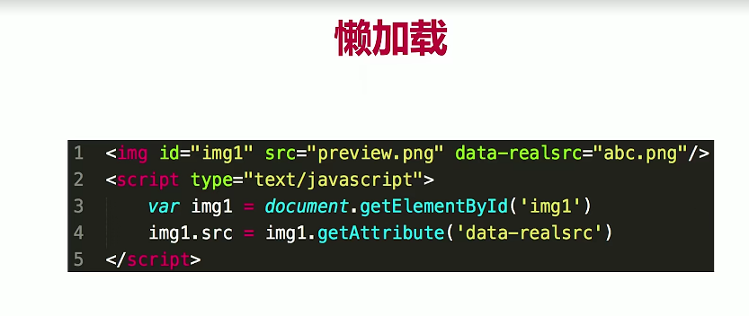
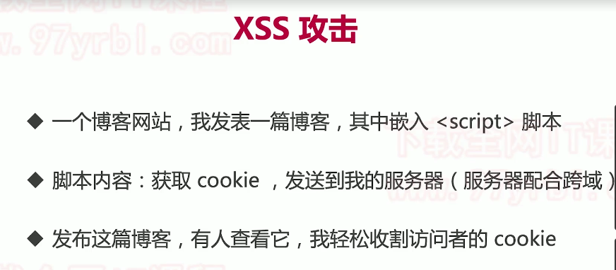
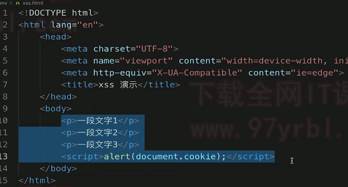
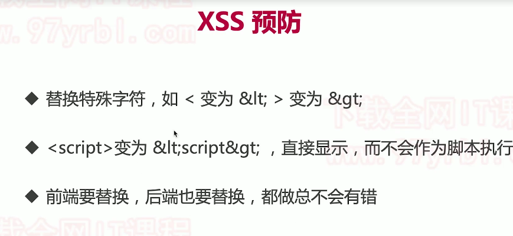

# 开发环境 development_environment

1. 网页加载过程
2. 性能优化
3. 安全

## 网页加载过程

#### 题目

-   从输入 url 到渲染页面的整个过程

（没有标准答案： 关注核心部分：前端）

-   window.onload 和 DOMContentLoaded 的区别

#### 知识点

-   加载资源的形式（ html 代码、 媒体文件 、JavaScript css ）

-   加载资源的过程

    1. DNS 解析： 域名服务解析 -> IP 地址
       为什么不用 IP 地址访问？ 1. 不容易记住 2. 不同地域，代理服务器不同，IP 地址也不同 CDN
    2. 浏览器根据 IP 地址向服务器发起 http 请求
    3. 服务器处理 http 请求，并返回给浏览器

-   渲染过程
    1. 根据 HTML 代码生成　 DOM Tree
    2. 根据 CSS 代码生成 CSSOM
    3. DOM Tree 和 CSSOM 整合成 RenderTree
    4. 根据 Render Tree 渲染页面
    5. 遇到 `<script>`则暂停渲染，优先加载并执行 JS 代码，完成后再继续（渲染和 js 代码执行共有一个线程）
    6. 直至把 Render tree 渲染完成

**思考：**

1. 为何建议把 css 放在 head 中？

放在 body 中，会发生重复渲染，消耗性能，放在 head 中，希望 css 样式 CSSOM 先在 DOM 树之前生成

2. 为什么 JS 放在 body 结尾？
   极端情况，在渲染过程中，遇到`<script>`标签会优先执行 JS 代码，停止页面的渲染。这并不是我们想看到的。
   JS 代码放在最后，在整个页面渲染结束后，显示该显示的，再执行 JS 代码修改相关的 DOM 元素

#### window.onload 和 DOMContentLoaded 的区别

```js
window.addEventListener('load', function() {
    // 页面的全部资源加载完，才会执行，包括图片，视频等
});

document.addEventListener('DOMContentLoaded', function() {
    // DOM 渲染完即可执行，此时图片，视频还可能没有加载完
});
```

## 性能优化

-   综合性问题，没有标准答案，要求尽量全面
-   细节问题： 手写防抖，节流代码（定时器知识）

#### 性能优化原则

-   多使用内存，缓存或者其他方法

-   减少 CPU 计算量，减少网络加载耗时

-   适用于所有编程的性能优化——空间换时间

    （示例：chrome 08 开始发布，10 年普及，速度快，为什么？

    核心就是以空间换时间，每一个标签页，新建一个进程）

    存在一个历史背景：chrome 普及之前，电脑内存有限。硬件限制。

**从两方面入手 ： 让加载更快 让渲染更快**

##### 第一点：让加载更快

1. 减少资源体积：压缩代码。前端 webpack 打包，服务器端：gzip

2. 减少访问次数：
   (1)合并代码：一个代码文件会导入多个包，webpack 打包将多个代码文件合并成一个代码文件。css 代码合并，雪碧图，定位处理显示。

    (2)SSR 服务端渲染：

    - 服务器端渲染： 将网页和数据一起加载，一起渲染
    - 非 SSR （前后端分离）先加载网页，再加载数据，再渲染数据
    - 早先的 JSP ASP PHP 现在的 vue React SSR

    (3) 缓存
    webpack 打包时，静态资源加 hash 后缀（contenthash）根据文件内容计算 hash (http 缓存-协商缓存)
    文件内容不变，则 hash 不变，则 url 不变
    url 和 文件不变，则会自动触发 http 缓存机制，返回 304（资源未改变）

3. 使用更快的网络： CDN(Content Delivery Network)是指内容分发网络，也称为内容传送网络

##### 第二点：让渲染更快

-   资源加载方面

1. css 放在 head, JS 放在 body 最下面

2. 尽早的开始执行 JS， 用 DOMContentLoaded 触发

    ```js
    window.addEventListener('load', function() {
        // 页面的全部资源加载完才会执行，包括图片、视频等
    });
    document.addEventListener('DOMContentLoaded', function() {
        // DOM 渲染完即可执行，此时图片，视频还可能没有加载完
    });
    ```

3. 懒加载（图片懒加载，上滑加载更多）
   
   判断图片到页面底部距离，进行渲染

-   DOM 操作方面

1.  对 DOM 查询进行缓存
2.  频繁 DOM 操作，合并到一起插入 DOM 结构
3.  节流 throttle 防抖 debounce (手写代码)

#### 手写防抖 debounce

场景：

-   监听一个输入框，文本变化后触发 change 事件
-   直接用 keyup 事件，则会频繁触发 change 事件
-   防抖：用户输入结束或者暂停时，才会触发 change 事件

```js
// 1. 定义一个定时器
let timer = null;
// 2. 监听键盘输入事件
input.addEventListener('keyup', function() {
    // 3. 定时器清空
    if (timer) {
        clearTimeout(timer);
    }
    // 4.定时触发 fn
    timer = setTimeout(() => {
        // 模拟触发 change 事件
        console.log(input.value);

        // 清空定时器
        timer = null;
    }, 500);
});
```

```js
// 防抖函数 debounce

function debounce(fn, delay = 500) {
    // timer 是在闭包中
    let timer = null;
    return function() {
        if (timer) {
            clearTimeout(timer);
        }

        timer = setTimeout(() => {
            fn.apply(this, arguments); // 将函数原本的this 和 参数传入
        }, delay);
    };
}

// 使用
input.addEventlistener(
    'keyup',
    debounce(function(e) {
        console.log(e.target);
        console.log(input.value);
    }, 600)
);
```

#### 手写节流 throttle

-   保持一个频率触发

场景：

-   拖拽一个元素时，要随时拿到该元素被拖拽的位置
-   直接用 drag 事件，则会频繁触发，很容易导致卡顿
-   节流： 无论拖拽速度多块，都会每间隔 100ms 触发一次

```js
const div1 = document.getElementById('div1');

let timer = null;
div1.addEventListener('drag', function(e) {
    if (timer) {
        return;
    }
    timer = setTimeout(() => {
        console.log(e.offsetX, e.offsetY);

        timer = null;
    }, 100);
});

// 节流
function throttle(fn, delay = 100) {
    let timer = null;

    return function() {
        if (timer) {
            return;
        }
        timer = setTimeout(() => {
            fn.apply(this, arguments); // apply 有什么用？ 绑定this ,绑定参数
            timer = null;
        }, delay);
    };
}

div1.addEventListener(
    'drag',
    throttle(function(e) {
        console.log(e.offsetX, e.offsetY);
    })
);

// 一般情况下
div1.addEventListener('drag', function(event))
```

## web 安全

#### 常见 web 前端攻击方式有哪些

-   XSS 跨站请求攻击

-   XSRF 跨站请求伪造

#### XSS 跨站请求攻击





替换工具 npm

#### XSRF 跨站请求伪造

为什么会发生呢？
首先用户已经登录这个网站了，cookies 生成了包含了当前的用户信息。 img 发送请求是支持跨域的，

**XSRF 预防**

-   使用 POST 接口
-   增加验证，例如密码，短信验证码，指纹
