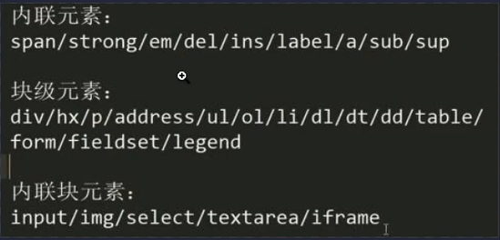

# HTML

超文本标记语言(英语:HyperText Markup Language,简称:HTML)是一种用于创建网页的标准标记语言。

## 1.什么是语义化标签？ 有哪些好处？

```
<header> 头部栏（LOGO 标题）
<nav> 导航
<article> 文章
<figure> 流内容
<aside> 侧边栏（相关信息，广告）
<footer> 底部栏（作者信息，联系信息）
```

### 好处：三点

**1. 有利于 SEO** (Search engine optimization)

-   SEO 就是 搜索引擎优化 的意思。为的是让网页**内容更容易被搜索到**。并且在**搜索结果中排名更高**。

-   当你的网页内容被机器所理解，网页所包含的信息也就更容易被搜索引擎检索到。

**2. 代码可读性更高**

-   不光为了是机器可以理解，语义化的 HTML 文档，对程序员来说也更容易阅读。很多时候自定义的`class`，`id`属性，并不能保证每个人都明白所表达的意思。

**3. 访问性更好**

-   当 CSS 样式不能正常工作的时候，语义化的 HTML 文档在浏览器仍然会保持正常，可阅读的结构。不至于完全崩坏。 2.默认情况下，哪些 HTML 标签是块级元素，哪些是内联元素？

## 2.HTML 标签 块级元素，内联元素（行内元素）

```
display:block/table
// 容器级别标签： div ,h系列，li,dt,以及文本标签 P
diaplay: inline/inline-block
// 除了P标签以外的 文本标签 span,a,b,i,u,em
```


