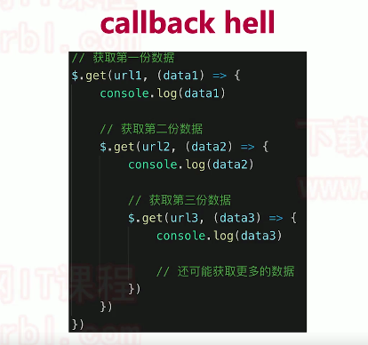
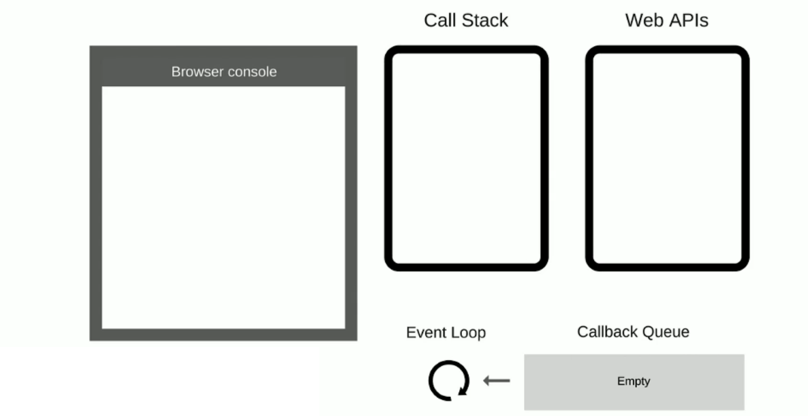
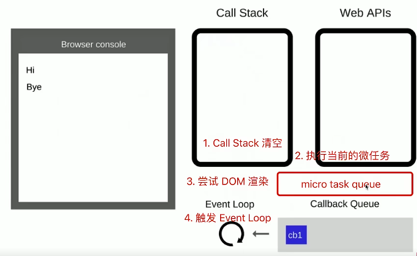
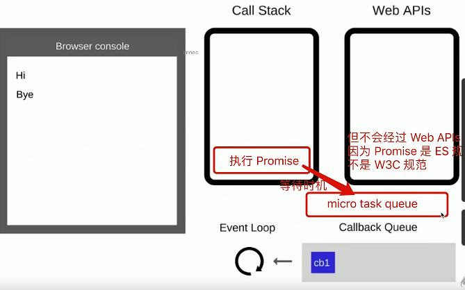
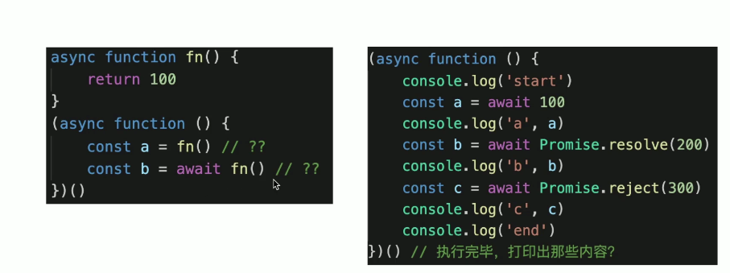

# 异步-async

### JavaScript 语言的一大特点就是单线程

## 同步和异步？

```js
// 同步
console.log(100);
alert(200);
console.log(300);

// 异步
console.log(100);
setTimeout(function() {
    console.log(200);
});
console.log(300);
```

#### 思考：

-   1.  为什么 JavaAcript 是单线程？

        参考：[阮一峰博客](http://www.ruanyifeng.com/blog/2014/10/event-loop.html)

-   2. js: 同步和异步区别？为什么需要异步？

        基于 JS 是单线程语言，异步不会阻塞代码执行，同步会阻塞代码执行，例如： 遇到等待（网络请求，定时任务）不能卡住

        这是由于 js 是单线程语言决定的。单线程执行代码是自上而下一步一步执行，会存在阻塞代码执行的情况存在。

        异步是为了解决代码阻塞的问题，异步基于 callback 函数 形式

## 异步应用在哪些场景？

1. 网络请求： AJAX 请求数据
2. 定时任务： setTimeout

## Promise 解决回调地狱（callback hell)

<center class="half">
    
</center>

```js
// promise 封装
function getData(url) {
    return new Promise((resolve, reject) => {
        $.ajax({
            url,
            success(data) {
                resolve(data);
            },
            error(err) {
                reject(err);
            },
        });
    });
}

// 网络请求
const url1 = '/data1.json';
const url2 = '/data2.json';
const url3 = '/data3.json';
getData(url)
    .then(data1 => {
        console.log(data1);
        return getData(url2);
    })
    .then(data => {
        console.log(data2);
        return getData(url3);
    })
    .then(data3 => {
        console.log(data3);
    })
    .catch(err => console.err(err));
```

## event-loop 事件循环/事件轮询

JS 是单线程运行的，异步是基于回调来实现的

event-loop 是 JS 异步回调机制的实现原理

回顾 JS 如何执行的，
**简单示例**

```js
console.log('Hi');

setTimeout(function cb1() {
    console.log('cb1'); // cb 即 callback
}, 5000);

console.log('Bye');
```

<center class="half">
    
</center>

**讲述 event loop 执行过程**

1. 先执行 `console.log('Hi');` 在浏览器控制台上打印 `Hi`
2. 再执行 setTimeout 函数，调用 WebAPIs 将 cb1 函数放入定时器中，等待 5s 后推入 callback queue ,清空 call stack
3. 再将 `console.log('Bye')`，推入 callstack 执行，在控制台打印 Bye , 清空 call stack
4. 此时同步代码执行结束，eventloop 机制启动，循环查询 callback queue
5. 定时器 5s 结束，函数 cb1 推入 callback queue 中，eventloop 将函数推入调用栈中执行
6. 执行函数内语句`console.log(cb1)`,控制台打印 cb1 。函数 cb1 执行结束。调用栈清空
7. 执行结束

总结：

-   同步代码， 一行一行放入 Call stack 执行
-   遇到异步， 会先“记录”，等待触发时机（定时，网络请求）
-   时机触发，就移动到 Callback queue 中
-   如 CallStack 为空（同步代码执行完）Eventloop 开始工作
-   轮询查找 Callback Queue， 如果存在函数 ，推入 CallStack 中执行
-   继续轮询查找（一遍一遍，类型永动机）

#### DOM 和 EventLoop

比较下面两段代码

```js
console.log('Hi');

setTimeout(function cb1() {
    console.log('cb1');
}, 5000);

console.log('Bye');
```

```html
<button class="btn1">提交</button>

<script>
    console.log('Hi');

    $('#btn1').click(function(e) {
        console.log('button clicked');
    });

    console.log('Bye');
</script>
<!--
    DOM 事件用 event loop 可以解释， 当执行到 click 事件时， 
    调用内部 WebAPI ,等待触发时机，将函数推到回调函数队列中，
    event loop 查询到执行
-->
```

**总结：**

-   JS 是单线程的
-   异步（setTimeout , Ajax 等）使用回调，基于 event loop
-   DOM 事件也是使用回调，基于 event loop 但是不是异步
-   DOM 事件操作和异步本质上都是回调函数，但是触发机制不一样

## promise 基本使用

#### 手写 Promise 加载一张照片

```js
// 加载图片
function loadImg(src) {
    const p = new Promise((resolve, reject) => {
        const img = document.createElement('img');
        img.onload = () => {
            resolve(img);
        };
        img.onerror = () => {
            const err = new Error(`图片加载失败 ${src}`);
            reject(err);
        };
        img.src = src;
    });
    return p;
}
const url = 'https://img.mukewang.com/5a9fc8070001a82402060220-140-140.jpg';
loadImg(url)
    .then(img => {
        console.log(img.width);
        return img;
    })
    .then(img => {
        console.log(img.height);
    })
    .catch(ex => console.error(ex));
```

#### 三种状态，状态的表现和变化

#### then 和 catch 对状态的影响（重要）

-   pending 不会触发任何 then catch 回调
-   状态变为 resolved 会触发后续的 then 回调
-   状态变为 rejected 会触发后续的 catch 回调

---

then catch 会继续返回 Promise ，**此时可能会发生状态变化！！！**

```js
// then() 一般正常返回 fulfilled 状态的 promise
Promise.resolve().then(() => {
    return 100;
});

// then() 里抛出错误，会返回 rejected 状态的 promise
Promise.resolve().then(() => {
    throw new Error('err');
});

// catch() 不抛出错误，会返回 fulfilled 状态的 promise
Promise.reject().catch(() => {
    console.error('catch some error');
});

// catch() 抛出错误，会返回 rejected 状态的 promise
Promise.reject().catch(() => {
    console.error('catch some error');
    throw new Error('err');
});
```

#### then 和 catch 的链式调用（常考）

看一个综合的例子，即那几个面试题

```js
// 第一题
Promise.resolve()
    .then(() => {
        console.log(1);
    })
    .catch(() => {
        console.log(2);
    })
    .then(() => {
        console.log(3);
    });

// 第二题
Promise.resolve()
    .then(() => {
        // 返回 rejected 状态的 promise
        console.log(1);
        throw new Error('erro1');
    })
    .catch(() => {
        // 返回 resolved 状态的 promise
        console.log(2);
    })
    .then(() => {
        console.log(3);
    });

// 第三题
Promise.resolve()
    .then(() => {
        // 返回 rejected 状态的 promise
        console.log(1);
        throw new Error('erro1');
    })
    .catch(() => {
        // 返回 resolved 状态的 promise
        console.log(2);
    })
    .catch(() => {
        console.log(3);
    });
```

## async 和 await

**背景**

-   异步回调 存在 callback hell 的问题
-   Promise then catch 链式调用，也是基于回调函数
-   async/await 是同步语法，彻底消灭回调函数

#### 语法介绍

#### async/await 和 Promise 的关系

async/await 和 Promise 是消灭异步回调的终极武器，但和 Promise 并不相斥
两者相辅相成。
关系为以下三点：
执行 async 函数返回的是 Promise 对象，async 是对 Promise 进一步封装
await 相当于 Promise 的 then
try...catch 捕获异常，代替 Promise 的 catch

```js
// 1. async 函数返回结果都是 Promise 对象 （如果函数内没返回 Promise ，则自动封装一下）
async function fn2() {
  return new Promise(() => ())
}
console.log(fn2())

async function fn1() {
	return 100
}
console.log(fn1())

// 2. await 后面跟 Promise 对象：会阻断后续代码，等待状态变为 resolved ，才获取结果并继续执行
// 3. await 后续跟非 Promise 对象：会直接返回

(async function () {
    const p1 = new Promise(() => {})
    await p1
    console.log('p1') // 不会执行
})()

(async function () {
    const p2 = Promise.resolve(100)
    const res = await p2
    console.log(res) // 100
})()

(async function () {
    const res = await 100
    console.log(res) // 100
})()

(async function () {
    const p3 = Promise.reject('some err')
    const res = await p3
    console.log(res) // 不会执行
})()

// try...catch 捕获 rejected 状态
(async function () {
    const p4 = Promise.reject('some err')
    try {
        const res = await p4
        console.log(res)
    } catch (ex) {
        console.error(ex)
    }
})()
```

总结来看：

-   async 封装 Promise
-   await 处理 Promise 成功
-   try...catch 处理 Promise 失败

## 异步循环 for...of

常规的循环： for... in /forEach /for 都是同步遍历

```js
function multi(num) {
    return new Promise((resolve, reject) => {
        setTimeout(() => {
            resolve(num * num);
        }, 1000);
    });
}

// 场景： 数组元素乘法输出

const nums = [1, 2, 3];

nums.forEach(async i => {
    const res1 = await multi(i);
    console.log('res1', res1);
});

// 使用 forEach ，是 1s 之后打印出所有结果，即 3 个值是一起被计算出来的

// 要求： 按照时间间隔打印结果

!(async function() {
    for (let i of nums) {
        const res = await multi(i);
        console.log(res);
    }
})();
```

## 宏任务 macroTask 和 微任务 microTask

#### 什么是宏任务和微任务？

**介绍**

## 介绍

-   宏任务：setTimeout setInterval AJAX DOM 事件
-   微任务：Promise（对于前端来说）async/await
-   微任务执行时机比宏任务更早

```js
console.log(100);
setTimeout(() => {
    console.log(200);
});
Promise.resolve().then(() => {
    console.log(300);
});
console.log(400);
// 100 400 300 200
```

#### eventLoop 和 DOM 渲染

-   JS 是单线程的，和 DOM 渲染共用一个线程
-   JS 是执行的时候，得留一些时机供 DOM 渲染
    

    -   每次 Call Stack 清空 （即每次轮询结束），即同步任务执行完
    -   都是 DOM 重新渲染的机会，DOM 解构如果有改变则重新渲染
    -   然后再触发下一次的 Event Loop

**代码演示：**

```js
const $p1 = $('<p>一段文字</p>');
const $p2 = $('<p>一段文字</p>');
const $p3 = $('<p>一段文字</p>');
$('#container')
    .append($p1)
    .append($p2)
    .append($p3);

console.log('length', $('#container').children().length);
alert('本次 call stack 结束，DOM 结构已更新，但尚未触发渲染');
// （alert 会阻断 js 执行，也会阻断 DOM 渲染，便于查看效果）
// 到此，即本次 call stack 结束后（同步任务都执行完了），浏览器会自动触发渲染，不用代码干预

// 另外，按照 event loop 触发 DOM 渲染时机，setTimeout 时 alert ，就能看到 DOM 渲染后的结果了
setTimeout(function() {
    alert('setTimeout 是在下一次 Call Stack ，就能看到 DOM 渲染出来的结果了');
});
```

#### 微任务和宏任务的区别？

-   宏任务：DOM 渲染后再触发，如 setTimeout
-   微任务：DOM 渲染前会触发，如 Promise

```js
const $p1 = $('<p>一段文字</p>');
const $p2 = $('<p>一段文字</p>');
const $p3 = $('<p>一段文字</p>');
$('#container')
    .append($p1)
    .append($p2)
    .append($p3);
// 微任务在DOM渲染前触发
Promise.resolve().then(() => {
    console.log('length1', $('#container').children().length); // 3
    alert('Promise then'); // DOM此时渲染了吗？NO
});

// 宏任务在DOM渲染后触发

setTimeout(() => {
    console.log('length1', $('#container').children().length); // 3
    alert('setTimeout'); // DOM此时渲染了吗？YES
});
```

#### 再深入思考一下：为何两者会有以上区别，一个在渲染前，一个在渲染后？

<center class="half">
    
</center>

从 EventLoop 进行分析：
宏任务：以 setTimeout 为例，在 call stack 执行结束，会调用 WebAPI 生成定时器，定时结束将回调函数推入 callbackQueue ,等待事件轮询开启。
而 DOM 渲染在每次 callStack 执行结束后进行，DOM 渲染，再执行 EventLoop
所以可以得到结论 宏任务在 DOM 渲染之后

微任务： call stack 执行 Promise 结束,等待时机会将函数推入 micro task queue 。
不会经过 WebAPIs 因为 Promise 是 ES 规范，不是 W3C 规范

-   微任务是 ES6 语法规定的
-   宏任务是浏览器规定的

当调用栈同步任务结束后，实际的执行流程如下：

1. CallStack 清空
2. 执行当前的微任务 micro task queue
3. 尝试 DOM 渲染
4. 触发 Event Loop callback Queue

#### 微任务和宏任务-总结

-   宏任务有哪些？ 微任务有哪些？ 微任务触发时机更早
-   微任务、宏任务 和 DOM 渲染的关系
-   微任务、宏任务 和 DOM 渲染，在 eventLoop 的过程

#### 题目

1.  描述 event loop 机制 （可画图）

-   回顾 eventloop 的过程
-   和 DOM 渲染的关系
-   微任务和宏任务在 eventloop 过程的不同处理

2. 什么是宏任务和微任务，两者区别？

-   宏任务：setTimeout, setInterval, Ajax, DOM 渲染
-   微任务： Promise , async/await
-   微任务执行的时机比宏任务早（进一步 和 DOM 渲染对比前后，再进一步：根本原因 ）

3. Promise 的三种状态，如何改变？

4. 场景题 Promise then 和 catch 的连接

5. 场景题 async/await 语法
    <center>
      
    </center>
6. 场景题 Promise 和 setTimeout 顺序

7. 场景题 外加 async/await 顺序执行的问题

```js
async function async1() {
    console.log('async1 start'); // 2
    await async2();
    // await 后面都作为回调内容 - 微任务
    console.log('async1 end'); // 6
}

async function async2() {
    console.log('async2'); // 3
}

console.log('script start'); // 1

setTimeout(function() {
    // 宏任务 setTimeout
    console.log('setTimeout'); // 8
}, 0);

async1();

// 初始化Promise ，传入的函数立即被执行
new Promise(function(resolve) {
    console.log('promise1'); // 4
    resolve();
}).then(function() {
    // 微任务
    console.log('promise2'); // 7
});

console.log('script end'); // 5

// 同步代码执行完毕（event loop -call stack 被清空）
// 执行微任务
// (尝试触发 DOM 渲染)
// 触发 Eventloop, 执行宏任务
```
