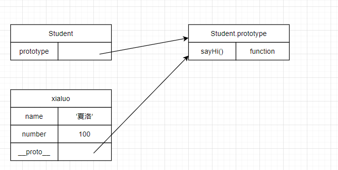
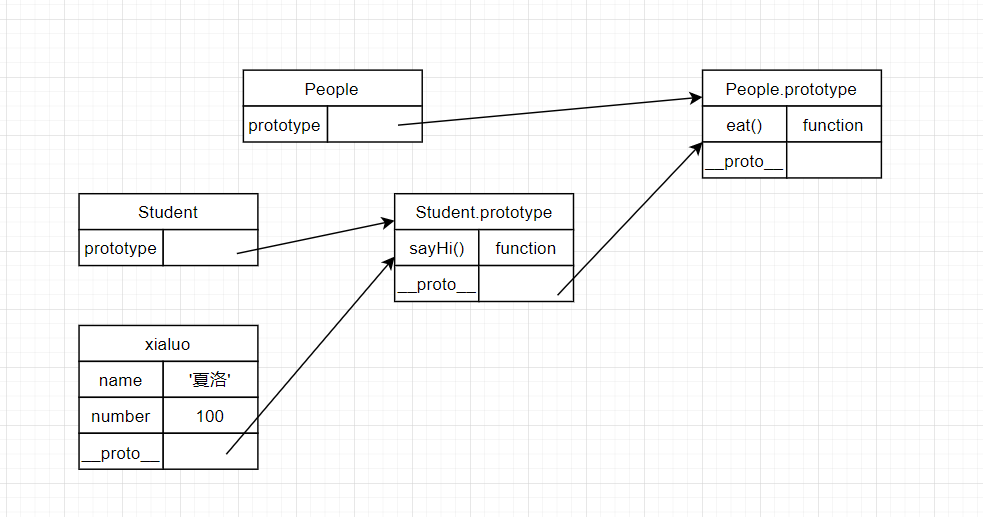
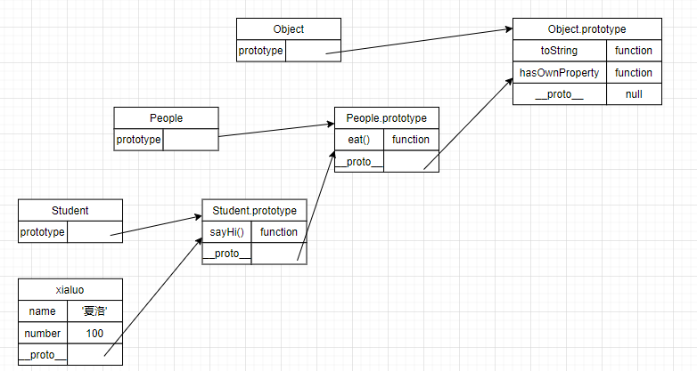

# 原型和原型链 （重要）

js 本身基于原型继承的语言，es6 之后 class 继承，但是也是基于原型链的基础 class 形式上的继承，本质上还是原型的继承。

**题目**：

1.  如何判断一个变量是不是数组？// 深入考虑 instanceof 是怎么检验数组

2.  手写一个简易的 jQuery ,考虑插件和扩展性

3.  class 的原型本质，怎么理解？

**知识点:**

-   class 和 继承

-   类型判断 instanceof

-   原型和原型链

### class 和 继承？

### class 面向对象

-   constructor
-   属性
-   方法

```js
// 实现一个 student 类
class Student {
    constructor(name, number) {
        this.name = name;
        this.number = number;
    }
    sayHi() {
        console.log(`姓名 ${this.name} , 学号 ${this.number}`);
    }
}

// 通过类声明对象/实例
const xiaohuo = new Student('夏洛', 100);
console.log(xiaohuo.name);
console.log(xiaohuo.number);
xiaohuo.sayHi();
```

#### 思考： new 的过程？

### 继承

-   extends
-   super 执行父类的构造函数
-   扩展或重写方法

```js
// 父类
class People {
    constructor(name) {
        this.name = name;
    }
    eat() {
        console.log(`${this.name} eat something`);
    }
}

// 子类
class Student extends People {
    constructor(name, number) {
        super(name);
        this.number = number;
    }
    sayHi() {
        console.log(`姓名 ${this.name} , 学号 ${this.number}`);
    }
}

class Teacher extends People {
    constructor(name, major) {
        super(name);
        this.major = major;
    }

    teach() {
        console.log(`${this.name} 教授 ${this.major}`);
    }
}
// 实例1
const xiaoluo = new Student('夏洛', 100);
console.log(xiaohuo.name);
console.log(xiaohuo.number);
xiaoluo.sayHi();
xiaoluo.eat();

// 实例2
const wang = new Teacher('王老师', '语文');
wang.eat();
wang.teach();
```

### 类型判断 - instanceof

可以判断数据的引用类型

```javascript
// 判断 变量属于那个class，或者说是属于哪个构造函数
xiaoming instanceof Student; // true
xiaoming instanceof People; // true
xiaoming instanceof Object; // true

Student instanceof People; // false
Student instanceof Object; // true
```

```javascript
// 判断数组
[] instanceof Array  // true
[] instanceof Object // true
// 判断是否为对象
{} instanceof Object // true
```

#### 表象叙述： 判断引用类型，object 是所有 class 的父类

### 深入的讲述原理：原型链

定义一个 Class People , typeof People 结果是什么？ 答案： "function"

### 原型： class 本质是一个 function 是一个语法糖

```javascript
//  如何理解 JS 原型（隐式原型和显示原型）
// _proto_ : 隐式原型
// prototype： 显示原型

// 针对 继承 写的 demo 控制台打印
console.log(xiaoluo.__proto__);
console.log(Student.prototype);
console.log(xialuo.__proto__ === Student.prototype);
```

### 原型图

**class 类原型图**


```js
<--
原型关系

每个class 都有显示原型 prototype

每个实例都有隐式原型   _proto_

实例的 _proto_ 指向对应class 的 prototype
-->
```

| 基于原型的执行规则                              |
| ----------------------------------------------- |
| 获取 xialuo.name 或者执行方法 xialuo.sayHi() 时 |
| 先找自身属性和方法寻找                          |
| 如果找不到则自动去 `_proto_`中查找              |

### 原型链

```js
console.log(Student.prototype.__proto__);
console.log(People.prototype);
console.log(People.prototype === Student.prototype.__prototype);
```

**class 继承原型图**


```js
// 判断属性或者方法是否属于实例，不属于原型链上 hasOwnProperty()
xialuo.hasOwnProperty('name'); // true
xialuo.hasOwnProperty('sayHi'); //  false
```



### 回看 instanceof

从 xialuo 实例的`_proto_` 顺着原型链查找 class 对应的`prototype`，从`student.prototype`,`people.prototype`,再到`object.prototype` .如果查找到就返回 true

相关的面试题

> 如何准确的判断一个变量是否为数组

```javascript
a instanceof Array;
```

> Class 原型本质

-   原型和原型的图示（要求：不参考任何资料，看着代码将图示展现出来）

-   属性和方法的执行规则

> JQuery_demo 简易的手写 代码

// 共有属性和方法

> 手写简易的 jQuery ? 考虑插件和扩展性

```js
// jquery demo
class jQuery {
    constructor(selector) {
        const result = document.querySelectorAll(selector);
        const length = result.length;
        for (let i = 0; i < length; i++) {
            this[i] = result[i];
        }
        this.length = length;
        this.selector = selector
    }

    get(index) {
      return this[index]
    }
    each(fn) {
      for( let i = 0; i < this.length, i++) {
        const elem = this[i]
        fn(elem)
      }
    }
    on(type, fn) {
      return this.each(elem => {
        elem.addEventListener(type, fn, false)
      })
    }
}


const $p = new jQuery('p')
$p.get(1)
$p.each((elem) => console.log(elem.nodeName))
$p.on('click', () => alert('clicked'))


// 插件
jQuery.prototype.dialog = function (info) {
  alert(info)
}

// “造轮子” 复写机制
class myJQuery extends jQuery {
  constructor(selector) {
    super(selector)
  }
  // 扩展自己的方法
  addClass(className) {

  }
  style(data) {

  }
}

```
