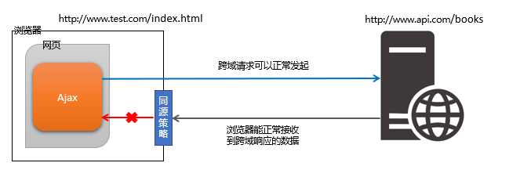

# ajax

web2.0 2015 年之后 ajax 开始普及

#### 题目

-   手写一个简易的 ajax
-   跨域的常用实现方式

#### 知识点

-   XMLHttpRequest
-   状态码
-   跨域：同源策略，跨域解决方案

#### XMLHttpRequest

```js
// GET
const xhr = new XMLHttpRequest();
xhr.open('GET', './data', true);
xhr.onreadystatechange = function() {
    if (xhr.readystate === 4 && xhr.status === 200) {
        console.log(xhr.responseText);
    } else {
        console.log('其他情况');
    }
};
xhr.send(null);

// POST
const xhr = new XMLHttpRequest();
xhr.open('POST', './login', true);
xhr.onreadstatechange = function() {
    if (xhr.readystate === 4) {
        if (xhr.status === 200) {
            console.log(xhr.responseText);
        } else if (xhr.status === 404) {
            console.log('其他情况');
        }
    }
};
const postData = {
    userName: 'zhangsan',
    password: 'xxx',
};

xhr.send(JSON.stringify(postData));
```

#### xhr.readystate

-   0 -(未初始化) 还没有调用 send() 方法
-   1 -(载入) 已调用 send() ,正在发送请求
-   2 -(载入完成)send() 方法执行完成，已经接收到全部响应内容
-   3 -(交互) 正在解析响应内容
-   4 -(完成) 响应内容解析完成，可以在客户端调用

#### xhr.status 状态码

-   2xx - 表示成功处理请求 如 200 201
-   3xx - 需要重定向，浏览器直接跳转， 如 301: 永久重定向 302： 临时重定向 304 ：缓存资源
-   4XX -客户端请求错误，如 404：地址错误，请求不到资源， 403：访问没有权限
-   5XX -服务器端错误

## 跨域

### 同源策略

-   在 ajax 请求时，浏览器要求当前页面和 server 必须同源

-   同源： 协议、域名、端口，三者必须一致

#### 跨域

-   同源指的是两个 URL 的协议、域名、端口一致，反之，则是跨域。
-   出现跨域的根本原因：浏览器的同源策略不允许非同源的 URL 之间进行资源的交互。
    例如： 网页：http://www.test.com/index.htm 接口：http://www.api.com/userlist

所有的跨域，都必须经过 server 端允许和配合

未经 server 端允许就实现跨域，说明浏览器有漏洞

### 常见的跨域解决方案

-   CORS、反向代理（Reverse Proxy）、 JSONP

#### CORS（Cross-origin Resource Sharing）跨域资源共享

#### 浏览器对跨域请求的拦截



浏览器允许发起跨域请求，但是，跨域请求回来的数据，会被浏览器拦截,无法被页面获取

#### 加载图片 css js 可无视同源策略

```html

<link href="跨域的css地址" />
<script src="跨域的js地址"><script>
```

例如： 外部加载的 CDN 链接，内嵌的图片（特殊：图片做了防盗链限制服务端）

应用场景：

-   ``可以用于统计打点，可使用第三方统计服务
-   `<link /> <script>` 可以使用 CDN ，CDN 一般都是外域
-   `<script>` 可以实现 JSONP

### JSONP

-   `<script>` 可以绕过跨域限制
-   通过 URL 访问服务器， 服务器可以任意动态拼接数据返回， 只要符合格式
-   所有 `<script>`可以获得跨域的数据，前提是服务端愿意返回

### CORS（服务端支持）

### 题目

**手写简单的 ajax 请求**

```js
// 简单版的ajax
function ajax(url, successFn) {
    const xhr = new XMLHttpRequest();
    xhr.open('GET', url, true);
    xhr.onreadystatechange = function() {
        if (xhr.readyState === 4) {
            if (xhr.status === 200) {
                successFn(xhr.responseText);
            }
        }
    };
    xhr.send(null);
}

// 利用promise 封装 ajax
function ajax(url) {
    const p = new Promise((resolve, reject) => {
        const xhr = new XMLHttpRequest();
        xhr.open('GET', url, true);
        xhr.onreadystatechange = function() {
            if (xhr.readyState === 4) {
                if (xhr.status === 200) {
                    resolve(JSON.parse(xhr.responseText));
                } else if (xhr.status === 404) {
                    reject(new Error('404 not found'));
                }
            }
        };
        xhr.send(null);
    });
    return p;
}

const url = './data/test.json';
ajax(url)
    .then(res => console.log(res))
    .catch(err => console.log(err));
```
