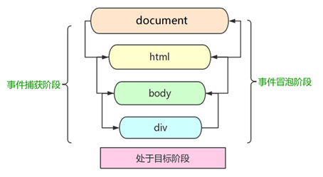

# 事件

## 事件绑定 和 事件冒泡

题目

-   编写一个通用的事件监听函数
-   描述事件冒泡的流程
-   无限下拉的图片列表，如何监听每个图片的点击（场景题）

知识点

-   事件绑定
-   事件冒泡
-   事件代理

## 事件绑定

```js
// addEventListener 函数
const btn = document.getElementById('btn1');

btn.addEventListener('click', event => {
    console.log('clicked');
});
```

**写一个通用的事件绑定函数**

```js
// 通用的事件绑定函数
function bindEvent(elem, type, fn) {
    elem.addEventListener(type, fn);
}

const a = document.getElementById('link1');

bindEvent(a, 'click', e => {
    console.log(e.target); // 获取触发的元素
    e.preventDefault(); // 阻止默认行为 例如：链接跳转
    alert('clicked');
});
```

## 事件冒泡

事件发生时会在元素节点之间按照特走的顺序传播，这个传播过程即 DoM 事件流。


事件捕获 -> 目标阶段 -> 事件冒泡

**事件冒泡** - lE 最早提出，事件开始时由最具体的元素接收，然后逐级向上传播到 DOM 最顶层节点的过程。

**当前目标阶段** - 事件发生的最具体元素（目标点）的捕获过程

**事件捕获** - 网景最早提出，由 DOM 最顶层节点开始，然后逐级向下传播到到最具体的元素接收的过程

```html
<div id="div1">
    <p id="p1">激活</p>
    <p id="p2">取消</p>
    <p id="p3">取消</p>
    <p id="p4">取消</p>
</div>
<div id="div2">
    <p id="p5">取消</p>
    <p id="p6">取消</p>
</div>
```

```js
const p1 = document.getElementById('p1');
bindEvent(p1, 'click', event => {
    event.stopPropagation(); // 阻止冒泡 注释此行观察变化
    console.log('激活');
});
const body = document.body;
bindEvent(body, 'click', event => {
    console.log('bodyClicked');
    console.log(event.target);
});
const div2 = document.getElementById('div2');
bindEvent(div2, 'click', event => {
    console.log('div2 clicked');
    console.log(event.target);
});
```

## 事件代理

在事件冒泡的基础上实现事件代理。示例： 瀑布流
代码模拟瀑布流：

```js
```

所谓的事件代理，处理多个元素绑定事件时，通过冒泡机制，将事件绑定到其共同的父元素上。

特点：

-   代码简洁
-   减少浏览器内存占用
-   不要滥用 - 根据场景进行使用

#### 通用的事件绑定函数（支持代理事件）

```js
function bindEvent(elem, type, selector, fn) {
    if (fn == null) {
        fn = selector;
        selector = null;
    }

    elem.addEventListener(type, function(event) {
        const target = event.target;
        if (selector) {
            // 代理绑定
            if (target.matches(selector)) {
                fn.call(target, event);
            }
        } else {
            // 普通绑定
            fn.call(target, event);
        }
    });
}

// 代理绑定

const div3 = document.getElementById('div3');

binEvent(div3, 'click', a, event => {
    event.preventDefault();
    alert(this.innerHTML); // this 触发的元素
});
```

## 问题

-   编写一个通用的事件监听函数
-   描述事件冒泡的流程
    1. 基于 DOM 树形结构
    2. 事件会顺着触发元素向上冒泡
    3. 应用场景： 事件代理
-   无限下拉的图片列表，如何监听每个图片的点击（场景题）
    1. 原理： 事件代理
    2. 用 e.target 获取触发元素
    3. 用 matches 来判断是否是触发元素
