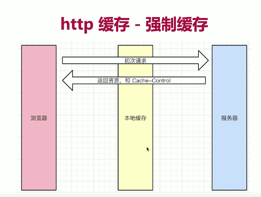

# http

前端开发界面时，需要调用后端接口，提交/获取数据 ---http 协议

前提要掌握好 ajax

#### 常见的题目

-   http 常见的状态码有哪些？
-   http 常见的 header 有哪些？
-   什么是 Restful API ?
    如何去理解？ 给你一个接口你是怎么设计的？
    传统 API 和 Restful API 区别？
-   描述一下 http 的缓存机制（重要）

## http 状态码

#### 状态码分类

-   1xx 服务器收到请求
-   2xx 请求成功，如 200
-   3xx 重定向， 如 301 302 304
-   4xx 客户端错误，如 401 403 404
-   5xx 服务端错误，如 500 504

#### 常见状态码

-   200 成功
-   301 永久重定向（配合 location， 浏览器自动处理） 应用场景：网页老域名不使用，返回新地址跳转
-   302 临时重定向（配合 location，浏览器自动处理） 应用场景：百度搜索页面，点击跳转对应的网址，中间会有一个重定向
-   304 资源未被修改 应用场景： 缓存，请求服务端数据，服务端返回 304 表示当前数据有效，浏览器使用本地缓存
-   401 用户没有访问权限，需要进行身份认证。

-   404 资源未被找到

-   403 没有权限，未登录，或者角色权限，

-   500 服务器错误，

-   504 网关超时

## http methods

#### 传统的 methods

-   get 获取服务器的数据

-   post 向服务器提交数据， 提交表单操作

#### 现在的 methods

-   get 获取数据

-   post 新建数据 ：博客提交

-   patch/put 更新数据 ：更新留言

-   delete 删除数据

## Restful API

-   传统 API ：把每个 URL 当做一个功能

-   Restful API 设计： 把每个 url 当做一个唯一的资源（标识或者 ID）

两者之间的区别：

### 如何将 Restful API 设计成一个资源

1. Restful API 设计不使用 url 参数

-   传统 API 设计: /api/list?pageIndex=2
-   Restful API 设计: /api/list/2

2. 用 method 表示操作类型（传统 API 设计 和 Restful API 设计对比）

**传统 API 设计**

-   POST 请求 /api/create-blog
-   POST 请求 /api/create-blog?id=100
-   GET 请求 /api/get-blog?id=100

**Restful API 设计**

-   post 请求 /api/blog
-   patch 请求 /api/blog/100
-   get 请求 /api/blog/100

## http header

**常见的 Request Headers（请求）**
| request header | description |
| ---------------------- | -------------------------------------------- |
| Accept | 浏览器可接收的数据格式 |
| Accept-Encoding | 浏览器可接收的压缩算法，如 gzip，deflate，br |
| Accep-Languange | 浏览器可接收的语言，如 zh-CN |
| Connection | keep-alive 一次 TCP 连接重复使用 |
| Host | 要请求的服务器域名 |
| cookie | |
| User-Agent （简称 UA） | 浏览器信息 chrome safari |
| Content-type | 发送数据的格式。如 application/json |

**常见 Response Headers（响应）**
| response header | description |
| ---------------- | ----------------------------------- |
| Content-type | 返回数据的格式，如 application/json |
| Content-length | 返回数据的大小，多少字节 |
| Content-Encoding | 返回数据的压缩算法，如 gzip |
| set-cookie | 服务器端修改 cookie |

**自定义 header**
常用的 ajax 库，axios,fetch 支持自定义请求头，应用场景：密钥

**缓存相关的 header**

-   Cache-Control | Expires
-   Last-Modified | If-Modified-Since
-   Etag | If-None-Match

## http 缓存（重要）

#### 缓存的介绍

**1. 什么是缓存？**

对于浏览器，第一次对服务器发起请求后，将返回的部分资源保存的本地

http 缓存指的是: 当客户端向服务器请求资源时，会先抵达浏览器缓存

如果浏览器有“要请求资源”的副本，就可以直接从浏览器缓存中提取而不是从原始服务器中提取这个资源。

当你第一次访问网页时，请求资源，第二次访问时，部分数据浏览器存有副本，则不再二次请求，读取本地资源，节约资源

**2. 为什么需要缓存**

最大的目的： 提升页面加载的速度

-   网络请求加载相比于，cpu 计算，页面渲染的速度是最慢的，所以减少网络请求的数量和体积提升整个页面加载的速度
-   网络请求不稳定的，受限于网络环境的影响
-   通过优化网络请求，可以提高整体页面加载的稳定性

**3. 哪些资源可以被缓存？ 静态资源（js css img）**

-   访问网站时，html 是不能被缓存的，随时会更新

-   业务数据一般不会被缓存，后台数据的增删改查

-   webpack 打包资源文件时会在 bundle 文件名后添加+hash 值 ,当文件内容被修改，hash 值随之也会改变

### http 缓存策略（强制缓存 + 协商缓存）（重要）

#### 强制缓存

<content></content>

#### Cache-Control

-   在 Response Headers 中
-   控制强制缓存的逻辑
-   例如：Cache-Control: max-age=3153600(单位是秒) 缓存有效期

#### Cache-Control 的 值

-   max-age: 最大缓存有效时间（常见）
-   no-cache ： 不用（强制）本地缓存，直接向服务器获取资源（常见）
-   no-store : 不用本地缓存，不用服务器缓存,直接让服务器返回数据
-   private：私人用户缓存
-   public： 公共资源的缓存，允许中间代理缓存数据

#### 关于 Expires

-   在 Response Headers 中
-   同为控制缓存过期
-   已被 Cache-Control 代替， 两者都存在以 Cache-Control 为主

#### 协商缓存（对比缓存）

> 服务器缓存策略

-   由服务器来判断资源是否需要浏览器进行本地缓存
-   浏览器第二次发送请求时，与服务器协商，服务器判断资源是否修改
-   如果没有修改，返回 304 状态码。 告诉浏览器可以使用缓存的资源，减少了服务器的数据传输的压力
-   如果资源有更新和修改，返回 200 状态码和更新后的资源并将缓存的信息一起返回

<content></content>

> 服务器判断资源是否修改? 通过资源标识对比

-   在 Response Headers 中，有两种：
-   Last-Modified 资源的最后修改时间
-   Etag 资源的唯一标识（一个字符串，类似人类的指纹）
    <content></content>
    <content></content>

#### Last-Modified 和 Etag 对比

-   会优先使用 Etag
-   Last-Modified 只能精确到秒级，相对于计算机以毫秒级，时间区间太宽泛了，
-   如果资源被重复生成，但是内容不变，Etag 更精确。Etag 是根据内容进行判断的。

    <content></content>

#### 刷新操作方式，对缓存的影响

**三种刷新操作：**

正常操作：地址栏输入 url , 跳转链接，前进后退等

手动刷新： F5，点击刷新按钮，右击菜单刷新

强制刷新： ctrl + F5

不同刷新操作，不同的缓存策略

正常操作： 强制缓存有效，协商缓存有效

手动刷新: 强制缓存失效，协商缓存有效

强制刷新： 强制缓存失效，协商缓存失效

### TCP 和 UDP 的区别？

在传输层有两个性质不同的协议：TCP（Transmission Control Protocol 传输控制协议）
UDP（User Data Protocol 用户数据报协议

> TCP 和 UDP 是传输层的两种协议， 两种协议有如下区别：

1. 连接方面
   TCP 是面向连接的，也就是说，在收发数据前，必须和对方建立可靠的连接。 一个 TCP 连接必须要经过三次“对话”才能建立起来。而 UDP 是无连接的：发送数据之前不需要建立连接

2. 数据传输可靠性方面
   TCP 提供可靠的数据传输，通过流量控制，序号，确认和定时器，TCP 确保正确的，有序的数据传输给客户端， UDP 只是尽最大努力交付，即不保证可靠交付
3. 实时性方面
   UDP 不需要建立连接，获取到数据就发送给客户端，所有它具有较好的实时性，工作效率比 TCP 高。

4. 连接数量
   每一个 TCP 连接是点对点的，UDP 支持一对一，一对多，多对一，多对多的交互通信

5. 资源需求方面
   TCP 对系统资源要求较多，UDP 对系统资源要求较少。

### TCP 三次握手和四次挥手全过程

字段含义：

1.  确认 ACK： 仅当 ACK=1 时，确认号字段才有效。TCP 规定，在连接建立后所有保温的传输必须把 ACK 置为 1

2.  同步 SYN： 在连接建立时用来同步序号。当 SYN = 1 ，ACK = 0,表明是连接请求报文。若同意连接，则响应报文中应该使 SYN = 1， ACK = 1

3.  终止 FIN： 用来释放连接。当 FIN=1，表明此报文的发送方的数据已经发送完毕，并要求释放。

#### 三次握手

### HTTP 和 HTTPS

1. HTTP 有哪些缺点？

## 网络和并发

### HTTP/1.0/1.1/2.0 在并发请求上主要的区别是什么？

1. HTTP/1.0
   每个 TCP 连接只能发送一个请求，当服务器响应后就会关闭这个连接，下一次请求需要再次建立 TCP 连接

    追问： 你说的每个连接只能发送一个请求，这个连接是指 HTTP 连接还是 TCP 连接？

2. HTTP/1.1

默认采用持久连接， TCP， Connection:keep-alive

Connection:close 关闭连接

增加了管道机制，在同一个 TCP 连接，允许多个请求同时发送。一问一答的形式
所有的数据通信是有顺序的， A，B, C. A 先到达服务器开始响应， 10S， 造成队头阻塞问题

3. HTTP/2.0

增加了双工模式，服务器也能同时处理多个请求，解决了队头阻塞的问题
多路复用，没有次序概念了
增加了服务器推送功能

### HTTP/1.1 的长连接和 2.0 的多路复用有什么区别？

1.1 同一时间一个 TCP 连接只能处理一个请求，采用一问一答的形式，上一个请求响应后，才能处理下一个请求。

追问： 听说 chrome 浏览器支持最大 6 个同域请求的并发

因为 Chrome 支持最大 6 个 TCP 连接

2.0： 同域名上的所有通信都在单个连接上完成，单个连接上可以并行交错的进行请求和响应

### 为什么 1.1 不能实现多路复用呢？

根本原因是两者传输的协议不一样。 HTT/2.0 是基于二进制的协议。HTTP/1.1 是基于文本分割解析的协议

1.1 报文结构里，服务器需要不断的读入字节，直到遇到换行符，处理的顺序是串行的

GET/ HTTP/1.1
Accept:
host:
referer:

POST

2.0 以帧为最小数据单位，每一帧都会标识自己属于哪个流，多个帧组成一个流

多路复用，其实就是一个 TCP 里存了多条流

### 前端代码里有什么方式控制最大并发量？

### 前端安全
